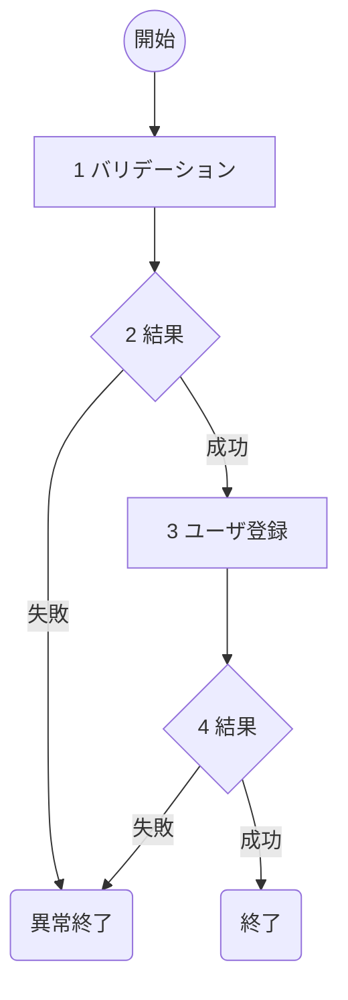

アプリケーション　個別機能ごとの詳細設計書を作成

## 以下を最後に表示してください
- 全ての処理が正常に成功した場合: `result: success`
- 何らかのエラーで失敗した場合： `result: failed: <失敗原因>`

## インプット
- docs/base/funclist.md（機能一覧、必須）　を読み込み
- docs/base/base-doc.md（基本設計書、必須）を読み込み
- docs/note/func/小機能.md（機能一覧、任意）　を読み込み

## 引数
- $ARGUMENT は 機能一覧の機能であること

## 概要
機能一覧の $ARGUMENT に関する機能について詳細なビジネスロジックを定義する。
各機能ごとにファイルを分割し、docs/detail/func/大機能_小機能.md（Ex. docs/detail/func/ユーザ管理_ログイン.md）で保存する。

## 詳細設計書の内容

### 概要
個別機能の機能名・概要を記述。
フォーマットは以下。

```markdown
## 概要
- **機能名**：ユーザ登録処理
- **概要**：XXXアプリのユーザ登録を行う。Google認証にも対応。
- **入力**: ユーザ名、パスワード
- **出力**: 作成されたToDoアイテム情報（JSON）
- **提供URL**: `/user/register` (POST)
```

### フロー図
プログラムの処理をmermaidで記述する。
各処理に番号を振り、具体的な処理を記述する。

#### フロー図
記述例：


#### 具体的な処理例
各処理で具体的な処理例を記述する。
ここを元に実装を行うため、**実装に必要な情報が過不足なく記述されていること**。
なお、条件分岐は前段の処理に含めてください。

以下は各処理で記述する具体例です。
1. バリデーションの場合
    - 名前(username)
        - 文字列であること
        - 50文字以内であること
        - 英語、数字、記号（%$）であること
2. DB登録
    - 対象DB名
        - このフィールドはDB名に区別する必要があるとき
        - DB01、DB02など
    - 対象テーブル名
    - 登録するフィールド
        - usernameには入力されたユーザ名
        - passwordにはsha256でハッシュ化して登録
3. DB取得
    - docs/detail/db.md（DB仕様書、任意）を読み込み
    - 対象DB
    - 対象テーブル名
    - 取得条件
        - username='Alice'
4. 外部連携
    - docs/detail/external.md（外部接続仕様書、任意）　を読み込み
    - 接続先：`http://www.foo.bar.jp`

### チェック事項
チェック事項を実施し、画面に表示してください。
- [ ] フロー図には各処理に番号が振られているか
- [ ] フロー図後に各番号に対する具体的な処理が書かれているか。処理は実装するうえで過不足ない内容になっているか

### アウトプット
docs/detail/func/大機能_小機能.md（Ex. docs/detail/func/ユーザ管理_ログイン.md）で保存する。
