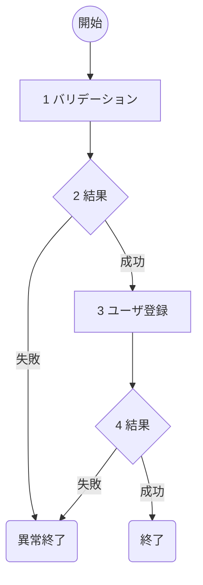

ソースコードからアプリケーション個別機能ごとの詳細設計書を逆生成

## 引数
- $ARGUMENT が未指定であればエラー終了

## インプット
- docs/base/func-list.md（機能一覧）　を読み込み
    - $ARGUMENT から機能ID及び機能名を取得
- docs/note/配下を読み込み
    - 無くても問題ない
    - 補足情報として利用
- docs/detail/db.md（DB仕様書）を読み込み
    - 無くても問題ない
- docs/detail/external.md（外部接続仕様書）　を読み込み
    - 無くても問題ない
- docs/detail/log.md（ログメッセージ一覧）を読み込み
    - 無くても問題はない
- docs/base/dir-struct.md（ディレクトリ構成）　を読み込み
    - 無ければエラー終了
    - ソースコードのディレクトリを確認
- ソースコードを読み込み
    - 無くても問題ない
    - ある場合は類似のソースコードを2～3ファイル確認し、アーキテクチャパターンや命名規則を分析

## 概要
各個別機能の詳細設計書　及び　ログメッセージ一覧を記述。

## 詳細設計書の内容

### 概要
個別機能の機能名・機能ID・概要を記述。
フォーマットは以下。

```markdown
1. 概要
    - 機能名：ユーザ登録処理(A01)
    - 概要：XXXアプリのユーザ登録を行う。Google認証にも対応。
```

### シーケンス図
機能のシーケンス図をmermaidで記述する。
モジュールや人物との関係性を表す。
具体的な処理は後程書くため、ここでは簡単に書いてください。

モジュールや人物を表す`participant`は数を絞ってください。
以下participantの例：
- ユーザ
    - Clientなど
- APP
- DB
- AWSサービス
    - Parameter Store / Redisなど
- 外部連携API
    - 各APIは個別に

各フローに番号を記載し、簡単な処理記述してください。
以下は記述例です。

```markdown
2. シーケンス
    \`\`\`mermaid
    sequenceDiagram
        participant UI
        participant API
        participant DB
        participant 外部API-A

        UI->>API: 1 POST /register（ユーザ情報）
        API->>API: 2 入力バリデーション
        API->>外部API-A: 3 情報要求
        外部API-A->>API: 4 情報取得
        API->>DB: 5 ユーザ情報をDBに登録
    \`\`\`

    1. 使用者はユーザ登録を行う
    2. 受け取った情報をDBに登録する
```

**ユーザに確認を行い、承認された場合にのみ次の処理を実行する**

### フロー図
プログラムの処理をmermaidで記述する。
各処理に番号を振り、具体的な処理を記述する。

#### フロー図
記述例：


#### 具体的な処理例
各処理で具体的な処理例を記述する。
ここを元に実装を行うため、**実装に必要な情報が過不足なく記述されていること**。
なお、条件分岐は前段の処理に含めてください。
また、ログメッセージはほかのログメッセージと被らないようにしてください。

以下は各処理で記述する具体例です。
1. バリデーションの場合
    - 名前(username)
        - 文字列であること
        - 50文字以内であること
        - 英語、数字、記号（%$）であること
        - エラー時の処理
            - バリデーション失敗時はログメッセージ（E-B0001）を出力し、処理を終了する
2. DB登録
    - 対象DB名
        - このフィールドはDB名に区別する必要があるとき
        - DB01、DB02など
    - 対象テーブル名
    - 登録するフィールド
        - usernameには入力されたユーザ名
        - passwordにはsha256でハッシュ化して登録
    - エラー時の処理
        - DB接続が不可の時はログメッセージ（E-B0002）を出力し、処理を終了
        - その他DB登録が不可であるときはログメッセージ（E-B0003）を出力し、処理を終了
3. DB取得
    - 対象DB
    - 対象テーブル名
    - 取得条件
        - username='Alice'
    - エラー時の処理
        - DB接続が不可のときはログメッセージ（E-B0003）を出力し、処理を終了
4. 外部連携
    - 接続先：`http://www.foo.bar.jp`
    - リクエスト形式：json
    - リクエスト内容
        ```json
        {"data": {"username": "Alice", "password": "Passw0rd"}}
        ```
    - レスポンス形式：json
    - レスポンス内容
        ```json
        {"errCode": 200, "data": {"foo": "bar"}}
        ```
    - エラー時の処理
        - API接続が不可のときはログメッセージ（E-B0004）を出力し、処理を終了
        - エラーコードが正常でないときはログメッセージ（E-B0005）を出力し、処理を終了

**ユーザに確認を行い、承認された場合にのみ次の処理を実行する**

### チェック事項
チェック事項を実施し、画面に表示してください。
- [ ] シーケンス図には各処理に番号が振られているか
- [ ] シーケンス図記述後、シーケンス図の各番号に対して簡単な処理内容が記述されているか
- [ ] フロー図には各処理に番号が振られているか
- [ ] フロー図後に各番号に対する具体的な処理が書かれているか。処理は実装するうえで過不足ない内容になっているか
- [ ] エラーIDにかぶりはないか
- [ ] claudeによる勝手な変更が無いか。提案等で勝手に変更していないこと。

### アウトプット
詳細設計書はdocs/detail/func/機能名.機能ID.md　で保存してください。

## ログメッセージ一覧
ログメッセージは docs/detail/message.md　に追記保存してください。
既存のログメッセージがある場合、破壊しないようにしてください。

出力フォーマットは以下例です。

```markdown
## アカウント追加(A01)
| メッセージID | ログレベル | ログ |
| -- | -- | -- |
| E-B0002 | ERROR | DBの接続に失敗しました。 |
```

## コンテキスト修正
docs/tmp/context.mdで、**詳細設計書・機能名(機能ID)**を生成済みに変更する。
`/CHECK-next-command`を実行し、次に行うべき処理を提案する。

