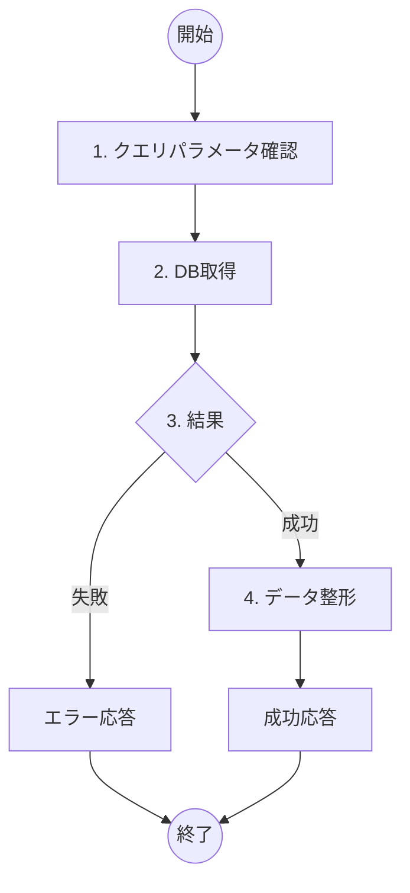

# ToDo一覧表示機能 詳細設計書

## 概要
- **機能名**：ToDo一覧表示処理
- **概要**：データベースに登録されているToDoアイテムの一覧を取得し、完了・未完了状態とともに表示する
- **入力**: なし（クエリパラメータによる絞り込みは任意）
- **出力**: ToDoアイテム一覧（JSON配列）
- **提供URL**: `api/todos` (GET)

## フロー図



## 具体的な処理

### 1. クエリパラメータ確認
- **completed（完了状態フィルタ）**
  - boolean型であること（任意項目）
  - true: 完了済みのToDoのみ取得
  - false: 未完了のToDoのみ取得
  - 未指定: 全てのToDoを取得
- **limit（取得件数制限）**
  - 数値型であること（任意項目）
  - 1以上100以下の範囲であること
  - 未指定時は全件取得
- **offset（取得開始位置）**
  - 数値型であること（任意項目）
  - 0以上の値であること
  - 未指定時は0（先頭から）

### 2. DB取得
- **対象テーブル名**: todos
- **取得条件**
  - completedパラメータが指定されている場合: `completed = [指定値]`
  - 指定されていない場合: 条件なし（全件）
- **並び順**: created_at DESC（作成日時の降順）
- **取得制限**: limitパラメータが指定されている場合は適用
- **取得開始位置**: offsetパラメータが指定されている場合は適用
- **取得フィールド**: id, title, description, completed, created_at, updated_at

### 3. 結果
- DB取得成功時：次の処理へ進む
- DB取得失敗時：エラーID E003、500 Internal Server Errorを返す

### 4. データ整形
- 取得したToDoアイテムをJSON配列形式に整形
- 各アイテムのタイムスタンプをISO 8601形式に変換
- descriptionがnullの場合は空文字列に変換

## エラーハンドリング

| エラーID | HTTPステータス | メッセージ | 発生条件 |
|---------|---------------|-----------|----------|
| E003 | 500 Internal Server Error | サーバーエラーが発生しました | DB取得失敗 |
| E004 | 400 Bad Request | クエリパラメータが不正です | パラメータバリデーション失敗 |

## 成功時の応答例

```json
[
  {
    "id": 1,
    "title": "買い物リスト作成",
    "description": "スーパーで野菜と肉を購入する",
    "completed": false,
    "created_at": "2024-01-15T10:30:00Z",
    "updated_at": "2024-01-15T10:30:00Z"
  },
  {
    "id": 2,
    "title": "会議資料準備",
    "description": "",
    "completed": true,
    "created_at": "2024-01-14T15:20:00Z",
    "updated_at": "2024-01-15T09:15:00Z"
  }
]
```

## 空の場合の応答例

```json
[]
```