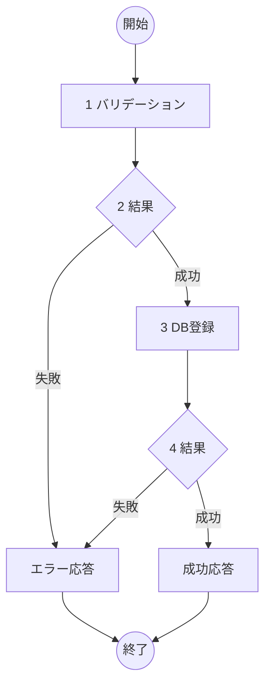

# ToDo作成機能 詳細設計書

## 概要
- **機能名**：ToDo作成処理
- **概要**：ToDoアプリケーションで新しいToDoアイテムを作成し、データベースに保存する
- **入力**: タイトル、詳細説明（任意）、住所情報（任意）
- **出力**: 作成されたToDoアイテム情報（JSON）
- **提供URL**: `api/todos` (POST)

## フロー図



## 具体的な処理

### 1. バリデーション
- **title（タイトル）**
  - 文字列であること
  - 1文字以上200文字以内であること
  - 空文字列は不可
- **description（詳細説明）**
  - 文字列であること（任意項目）
  - 1000文字以内であること
  - null または未指定は許可
- **postal_code（郵便番号）** 
  - 文字列であること（任意項目）
  - 7桁の数字（ハイフンなし）の形式であること
  - null または未指定は許可
- **address（住所）**
  - 文字列であること（任意項目）  
  - 500文字以内であること
  - null または未指定は許可

### 2. 結果
- バリデーション成功時：次の処理へ進む
- バリデーション失敗時：エラーID E001、400 Bad Requestを返す

### 3. DB登録
- **対象テーブル名**: todos
- **登録するフィールド**
  - title: 入力されたタイトル
  - description: 入力された詳細説明（null可）
  - completed: FALSE（デフォルト値）
  - created_at: 現在日時（自動設定）
  - updated_at: 現在日時（自動設定）

### 4. 結果
- DB登録成功時：作成されたToDoアイテム情報をJSON形式で返す（201 Created）
- DB登録失敗時：エラーID E002、500 Internal Server Errorを返す

## エラーハンドリング

| エラーID | HTTPステータス | メッセージ | 発生条件 |
|---------|---------------|-----------|----------|
| E001 | 400 Bad Request | 入力値が不正です | バリデーション失敗 |
| E002 | 500 Internal Server Error | サーバーエラーが発生しました | DB登録失敗 |

## 成功時の応答例

```json
{
  "id": 1,
  "title": "買い物リスト作成",
  "description": "スーパーで野菜と肉を購入する",
  "completed": false,
  "created_at": "2024-01-15T10:30:00Z",
  "updated_at": "2024-01-15T10:30:00Z"
}
```