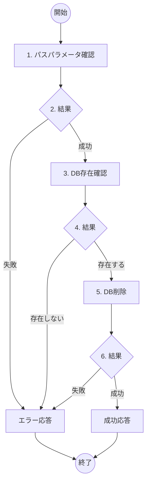

# ToDo削除機能 詳細設計書

## 概要
- **機能名**：ToDo削除処理
- **概要**：指定されたToDoアイテムをデータベースから完全に削除する
- **入力**: ToDo ID（パスパラメータ）
- **出力**: 削除完了メッセージ（JSON）
- **提供URL**: `api/todos/{todo_id}` (DELETE)

## フロー図



## 具体的な処理

### 1. パスパラメータ確認
- **todo_id（ToDo ID）**
  - 数値型であること
  - 1以上の値であること

### 2. 結果
- パスパラメータ正常時：次の処理へ進む
- パスパラメータ不正時：エラーID E005、400 Bad Requestを返す

### 3. DB存在確認
- **対象テーブル名**: todos
- **取得条件**: `id = [todo_id]`
- **取得フィールド**: id

### 4. 結果
- 対象レコードが存在する場合：次の処理へ進む
- 対象レコードが存在しない場合：エラーID E006、404 Not Foundを返す

### 5. DB削除
- **対象テーブル名**: todos
- **削除条件**: `id = [todo_id]`
- **削除方式**: 物理削除（レコードを完全に削除）

### 6. 結果
- DB削除成功時：削除完了メッセージをJSON形式で返す（200 OK）
- DB削除失敗時：エラーID E008、500 Internal Server Errorを返す

## エラーハンドリング

| エラーID | HTTPステータス | メッセージ | 発生条件 |
|---------|---------------|-----------|----------|
| E005 | 400 Bad Request | ToDo IDが不正です | パスパラメータ不正 |
| E006 | 404 Not Found | 指定されたToDoが見つかりません | 対象レコード不存在 |
| E008 | 500 Internal Server Error | サーバーエラーが発生しました | DB削除失敗 |

## 成功時の応答例

```json
{
  "message": "ToDoアイテムが正常に削除されました",
  "deleted_id": 1
}
```