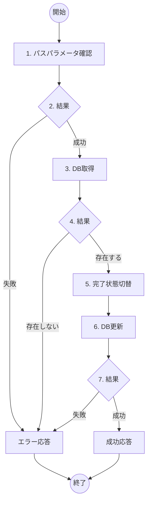

# ToDo完了状態切替機能 詳細設計書

## 概要
- **機能名**：ToDo完了状態切替処理
- **概要**：指定されたToDoアイテムの完了状態をトグル（未完了→完了、完了→未完了）してデータベースを更新する
- **入力**: ToDo ID（パスパラメータ）
- **出力**: 更新されたToDoアイテム情報（JSON）
- **提供URL**: `api/todos/{todo_id}/toggle` (PATCH)

## フロー図



## 具体的な処理

### 1. パスパラメータ確認
- **todo_id（ToDo ID）**
  - 数値型であること
  - 1以上の値であること

### 2. 結果
- パスパラメータ正常時：次の処理へ進む
- パスパラメータ不正時：エラーID E005、400 Bad Requestを返す

### 3. DB取得
- **対象テーブル名**: todos
- **取得条件**: `id = [todo_id]`
- **取得フィールド**: id, title, description, completed, created_at, updated_at

### 4. 結果
- 対象レコードが存在する場合：次の処理へ進む
- 対象レコードが存在しない場合：エラーID E006、404 Not Foundを返す

### 5. 完了状態切替
- **切替ロジック**
  - 現在の`completed`が`FALSE`の場合 → `TRUE`に変更
  - 現在の`completed`が`TRUE`の場合 → `FALSE`に変更

### 6. DB更新
- **対象テーブル名**: todos
- **更新条件**: `id = [todo_id]`
- **更新するフィールド**
  - completed: 切替後の完了状態
  - updated_at: 現在日時（自動更新）

### 7. 結果
- DB更新成功時：更新後のToDoアイテム情報をJSON形式で返す（200 OK）
- DB更新失敗時：エラーID E009、500 Internal Server Errorを返す

## エラーハンドリング

| エラーID | HTTPステータス | メッセージ | 発生条件 |
|---------|---------------|-----------|----------|
| E005 | 400 Bad Request | ToDo IDが不正です | パスパラメータ不正 |
| E006 | 404 Not Found | 指定されたToDoが見つかりません | 対象レコード不存在 |
| E009 | 500 Internal Server Error | サーバーエラーが発生しました | DB更新失敗 |

## 成功時の応答例

### 未完了→完了に切り替えた場合

```json
{
  "id": 1,
  "title": "買い物リスト作成",
  "description": "スーパーで野菜と肉を購入する",
  "completed": true,
  "created_at": "2024-01-15T10:30:00Z",
  "updated_at": "2024-01-15T16:20:00Z"
}
```

### 完了→未完了に切り替えた場合

```json
{
  "id": 1,
  "title": "買い物リスト作成",
  "description": "スーパーで野菜と肉を購入する",
  "completed": false,
  "created_at": "2024-01-15T10:30:00Z",
  "updated_at": "2024-01-15T16:25:00Z"
}
```