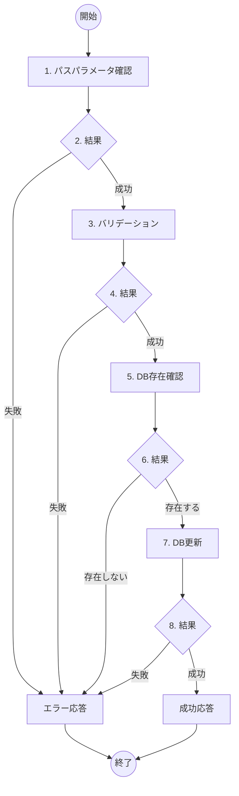

# ToDo編集機能 詳細設計書

## 概要
- **機能名**：ToDo編集処理
- **概要**：指定されたToDoアイテムのタイトル、詳細説明、住所情報を更新してデータベースに保存する
- **入力**: ToDo ID（パスパラメータ）、タイトル、詳細説明（任意）、住所情報（任意）
- **出力**: 更新されたToDoアイテム情報（JSON）
- **提供URL**: `api/todos/{todo_id}` (PUT)

## フロー図



## 具体的な処理

### 1. パスパラメータ確認
- **todo_id（ToDo ID）**
  - 数値型であること
  - 1以上の値であること

### 2. 結果
- パスパラメータ正常時：次の処理へ進む
- パスパラメータ不正時：エラーID E005、400 Bad Requestを返す

### 3. バリデーション
- **title（タイトル）**
  - 文字列であること
  - 1文字以上200文字以内であること
  - 空文字列は不可
- **description（詳細説明）**
  - 文字列であること（任意項目）
  - 1000文字以内であること
  - null または未指定は許可
- **postal_code（郵便番号）** 
  - 文字列であること（任意項目）
  - 7桁の数字（ハイフンなし）の形式であること
  - null または未指定は許可
- **address（住所）**
  - 文字列であること（任意項目）  
  - 500文字以内であること
  - null または未指定は許可

### 4. 結果
- バリデーション成功時：次の処理へ進む
- バリデーション失敗時：エラーID E001、400 Bad Requestを返す

### 5. DB存在確認
- **対象テーブル名**: todos
- **取得条件**: `id = [todo_id]`
- **取得フィールド**: id

### 6. 結果
- 対象レコードが存在する場合：次の処理へ進む
- 対象レコードが存在しない場合：エラーID E006、404 Not Foundを返す

### 7. DB更新
- **対象テーブル名**: todos
- **更新条件**: `id = [todo_id]`
- **更新するフィールド**
  - title: 入力されたタイトル
  - description: 入力された詳細説明（null可）
  - updated_at: 現在日時（自動更新）

### 8. 結果
- DB更新成功時：更新後のToDoアイテム情報をJSON形式で返す（200 OK）
- DB更新失敗時：エラーID E007、500 Internal Server Errorを返す

## エラーハンドリング

| エラーID | HTTPステータス | メッセージ | 発生条件 |
|---------|---------------|-----------|----------|
| E001 | 400 Bad Request | 入力値が不正です | バリデーション失敗 |
| E005 | 400 Bad Request | ToDo IDが不正です | パスパラメータ不正 |
| E006 | 404 Not Found | 指定されたToDoが見つかりません | 対象レコード不存在 |
| E007 | 500 Internal Server Error | サーバーエラーが発生しました | DB更新失敗 |

## 成功時の応答例

```json
{
  "id": 1,
  "title": "買い物リスト更新",
  "description": "スーパーで野菜、肉、調味料を購入する",
  "completed": false,
  "created_at": "2024-01-15T10:30:00Z",
  "updated_at": "2024-01-15T14:45:00Z"
}
```