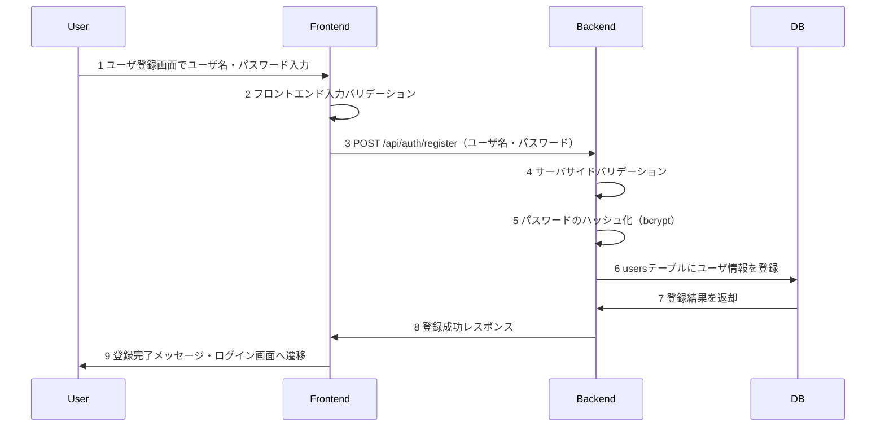
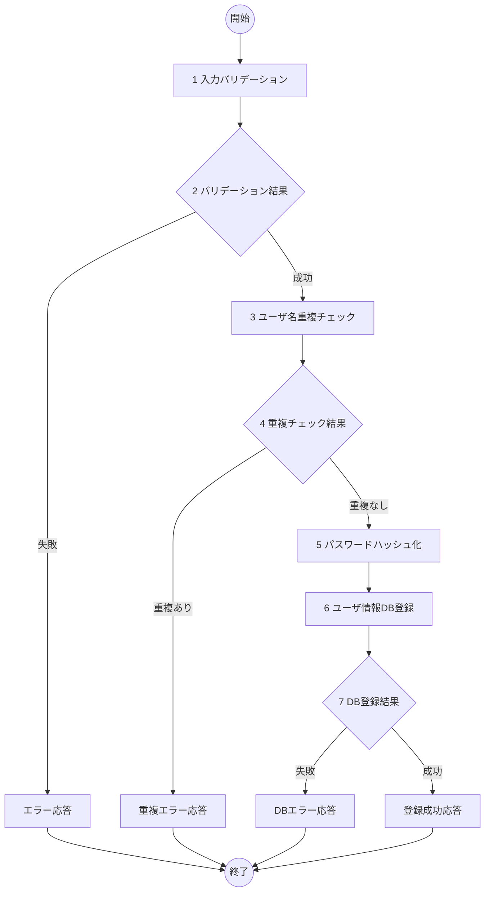

# ユーザ登録機能 詳細設計書

## 1. 概要
- 機能名：ユーザ登録(U01)
- 概要：ToDoアプリケーションの新規ユーザアカウント作成機能。ユーザ名・パスワードの入力を受け取り、MySQL のusersテーブルに安全にハッシュ化して保存する。

## 2. シーケンス

1. ユーザが登録画面でユーザ名・パスワードを入力し登録ボタンを押下
2. フロントエンドで入力値の基本バリデーションを実施
3. バックエンドAPIにユーザ登録リクエストを送信
4. バックエンドでサーバサイドバリデーションを実施
5. パスワードをbcryptでハッシュ化
6. MySQLのusersテーブルにユーザ情報を登録
7. データベースから登録結果を受け取り
8. フロントエンドに成功レスポンスを返却
9. ユーザに登録完了を通知し、ログイン画面に遷移

## 3. フロー図

## 4. 具体的な処理例

### 1. 入力バリデーション
- username（ユーザ名）
  - 文字列であること
  - 50文字以内であること
  - 英数字のみであること
  - 空文字でないこと
  - エラー時の処理
    - バリデーション失敗時はログメッセージ（E-U0101）を出力し、処理を終了する
- password（パスワード）
  - 文字列であること
  - 8文字以上50文字以内であること
  - 英数字と記号（!@#$%^&*）を含むこと
  - エラー時の処理
    - バリデーション失敗時はログメッセージ（E-U0102）を出力し、処理を終了する

### 3. ユーザ名重複チェック
- 対象テーブル名：users
- 取得条件
  - username='入力されたユーザ名'
- エラー時の処理
  - DB接続が不可のときはログメッセージ（E-U0103）を出力し、処理を終了
  - ユーザ名が既に存在するときはログメッセージ（E-U0104）を出力し、処理を終了

### 5. パスワードハッシュ化
- bcryptライブラリを使用
- salt rounds = 12
- エラー時の処理
  - ハッシュ化に失敗したときはログメッセージ（E-U0105）を出力し、処理を終了

### 6. ユーザ情報DB登録
- 対象テーブル名：users
- 登録するフィールド
  - usernameには入力されたユーザ名
  - passwordにはbcryptでハッシュ化されたパスワード
  - created_atは自動設定（CURRENT_TIMESTAMP）
  - updated_atは自動設定（CURRENT_TIMESTAMP）
- エラー時の処理
  - DB接続が不可のときはログメッセージ（E-U0106）を出力し、処理を終了
  - その他DB登録が不可であるときはログメッセージ（E-U0107）を出力し、処理を終了

## 5. チェック事項
- [x] シーケンス図には各処理に番号が振られているか
- [x] シーケンス図記述後、シーケンス図の各番号に対して簡単な処理内容が記述されているか
- [x] フロー図には各処理に番号が振られているか
- [x] フロー図後に各番号に対する具体的な処理が書かれているか。処理は実装するうえで過不足ない内容になっているか
- [x] エラーIDにかぶりはないか
- [x] claudeによる勝手な変更が無いか。提案等で勝手に変更していないこと。