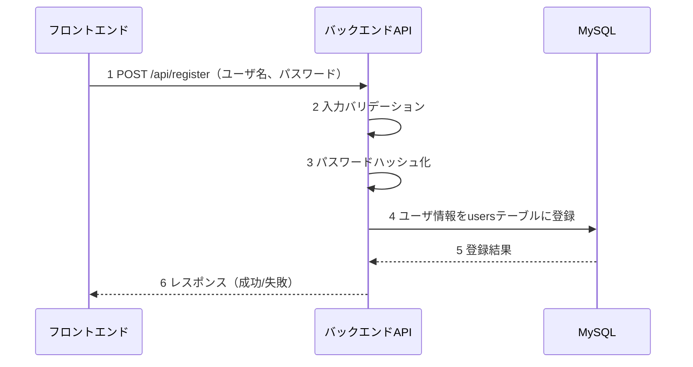
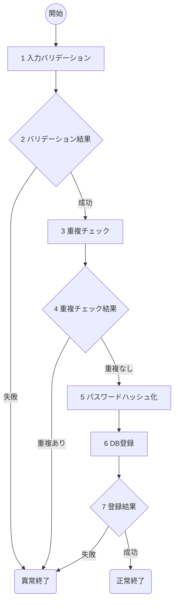

# ユーザ登録(U01) 詳細設計書

## 1. 概要
- 機能名：ユーザ登録(U01)
- 概要：ToDoアプリケーションの新規ユーザアカウント作成を行う。ユーザ名とパスワードを受け取り、パスワードをbcryptでハッシュ化してusersテーブルに登録する。

## 2. シーケンス

1. フロントエンドから新規ユーザの登録情報を受け取る
2. ユーザ名とパスワードの入力値をバリデーション
3. パスワードをbcryptでハッシュ化
4. ユーザ情報をデータベースに登録
5. データベースから登録結果を受け取る
6. フロントエンドに処理結果を返却

## 3. フロー図

### 具体的な処理
1. **入力バリデーション**
    - ユーザ名(username)
        - 文字列であること
        - 1文字以上50文字以内であること
        - 英数字とアンダースコアのみ許可（^[a-zA-Z0-9_]+$）
        - エラー時の処理
            - バリデーション失敗時はログメッセージ（E-U0001）を出力し、HTTPステータス400で処理を終了
    - パスワード(password)
        - 文字列であること
        - 8文字以上255文字以内であること
        - エラー時の処理
            - バリデーション失敗時はログメッセージ（E-U0002）を出力し、HTTPステータス400で処理を終了

2. **バリデーション結果**
    - 入力値のバリデーション結果を判定

3. **重複チェック**
    - 対象テーブル名：users
    - 取得条件：username = '入力されたユーザ名'
    - エラー時の処理
        - DB接続が不可のときはログメッセージ（E-U0003）を出力し、HTTPステータス500で処理を終了

4. **重複チェック結果**
    - 同一ユーザ名の存在確認
    - 重複ありの場合はログメッセージ（E-U0004）を出力し、HTTPステータス409で処理を終了

5. **パスワードハッシュ化**
    - bcryptを使用してパスワードをハッシュ化（salt rounds: 12）
    - エラー時の処理
        - ハッシュ化失敗時はログメッセージ（E-U0005）を出力し、HTTPステータス500で処理を終了

6. **DB登録**
    - 対象テーブル名：users
    - 登録するフィールド
        - username：入力されたユーザ名
        - password_hash：bcryptでハッシュ化されたパスワード
        - created_at：現在日時（自動設定）
        - updated_at：現在日時（自動設定）
    - エラー時の処理
        - DB登録が失敗した場合はログメッセージ（E-U0006）を出力し、HTTPステータス500で処理を終了

7. **登録結果**
    - データベース登録結果を判定
    - 成功時はログメッセージ（I-U0001）を出力し、HTTPステータス201で正常終了