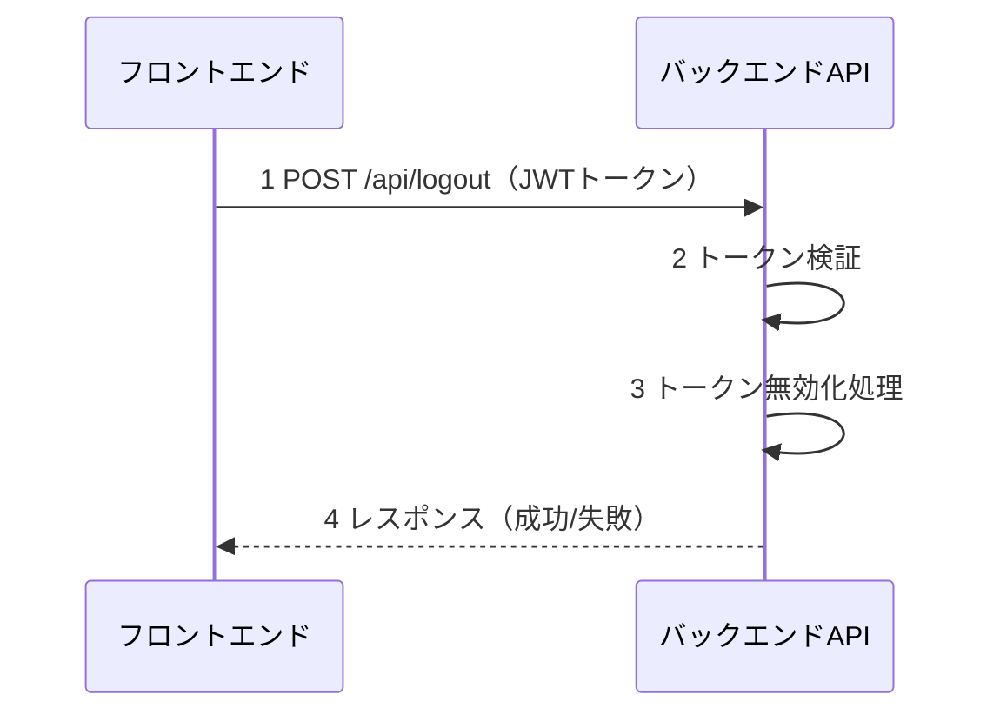
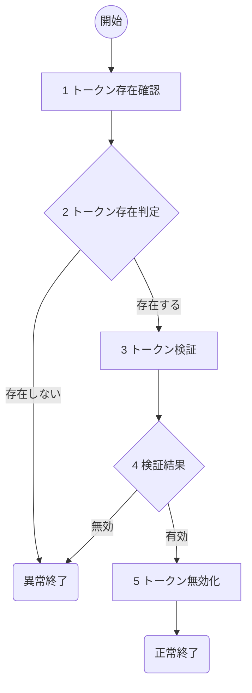

# ログアウト(U03) 詳細設計書

## 1. 概要
- 機能名：ログアウト(U03)
- 概要：ToDoアプリケーションのユーザログアウト処理を行う。JWTトークンを無効化し、セッション情報を削除する。

## 2. シーケンス

1. フロントエンドからログアウト要求とJWTトークンを受け取る
2. 受け取ったJWTトークンの有効性を検証
3. トークン無効化処理とセッション情報削除
4. フロントエンドに処理結果を返却

## 3. フロー図

### 具体的な処理
1. **トークン存在確認**
    - リクエストヘッダーからAuthorizationヘッダーを取得
    - Bearer形式のJWTトークンが含まれているかチェック
    - エラー時の処理
        - トークンが存在しない場合はログメッセージ（E-U0014）を出力し、HTTPステータス401で処理を終了

2. **トークン存在判定**
    - JWTトークンの存在有無を判定

3. **トークン検証**
    - JWTトークンの署名を検証
    - トークンの有効期限をチェック
    - ペイロードからuser_idとusernameを取得
    - エラー時の処理
        - トークン検証処理でエラーが発生した場合はログメッセージ（E-U0015）を出力し、HTTPステータス500で処理を終了

4. **検証結果**
    - トークンの有効性を判定
    - 無効（期限切れ・改ざん等）の場合はログメッセージ（E-U0016）を出力し、HTTPステータス401で処理を終了

5. **トークン無効化**
    - セッション情報の削除処理
    - フロントエンド側でトークンを削除するよう指示
    - 成功時の処理
        - ログメッセージ（I-U0003）を出力し、HTTPステータス200で正常終了