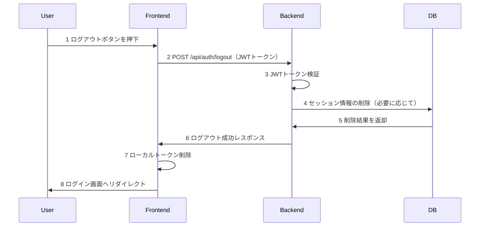
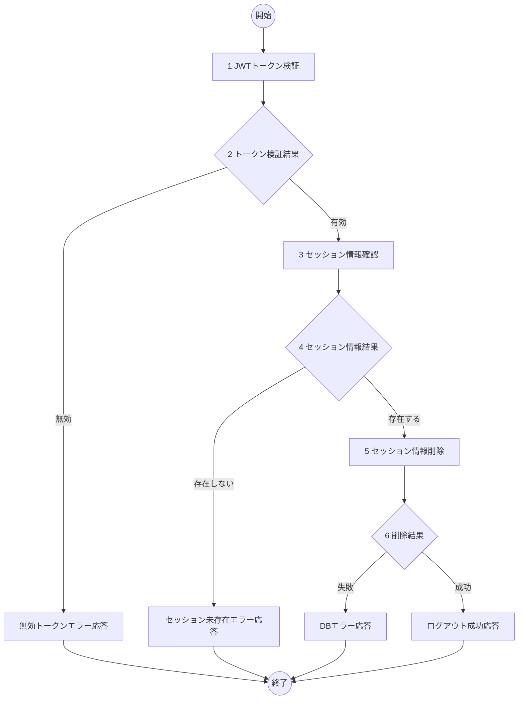

# ログアウト機能 詳細設計書

## 1. 概要
- 機能名：ログアウト(U03)
- 概要：ToDoアプリケーションのユーザセッションを終了し、ログイン画面に遷移する。JWTトークンの検証とセッション情報の削除を行う。

## 2. シーケンス

1. ユーザがログアウトボタンを押下
2. バックエンドAPIにログアウトリクエストを送信
3. JWTトークンの検証を実施
4. 必要に応じてDBのセッション情報を削除
5. データベースから削除結果を受け取り
6. フロントエンドに成功レスポンスを返却
7. フロントエンドでローカルトークンを削除
8. ログイン画面にリダイレクト

## 3. フロー図

## 4. 具体的な処理例

### 1. JWTトークン検証
- JWTトークンの有効性をチェック
  - トークンが存在すること
  - トークンの署名が正しいこと
  - トークンの有効期限内であること
  - エラー時の処理
    - トークンが無効な場合はログメッセージ（E-U0301）を出力し、処理を終了する

### 3. セッション情報確認
- 対象テーブル名：users
- 取得条件
  - id='JWTトークンから取得したユーザID'
- エラー時の処理
  - DB接続が不可のときはログメッセージ（E-U0302）を出力し、処理を終了
  - ユーザが存在しないときはログメッセージ（E-U0303）を出力し、処理を終了

### 5. セッション情報削除
- 処理内容：必要に応じてセッション関連情報をクリア
  - ログアウト時刻の記録
  - アクティブセッション情報の無効化
- エラー時の処理
  - DB接続が不可のときはログメッセージ（E-U0304）を出力し、処理を終了
  - その他DB更新が不可であるときはログメッセージ（E-U0305）を出力し、処理を終了

## 5. チェック事項
- [x] シーケンス図には各処理に番号が振られているか
- [x] シーケンス図記述後、シーケンス図の各番号に対して簡単な処理内容が記述されているか
- [x] フロー図には各処理に番号が振られているか
- [x] フロー図後に各番号に対する具体的な処理が書かれているか。処理は実装するうえで過不足ない内容になっているか
- [x] エラーIDにかぶりはないか
- [x] claudeによる勝手な変更が無いか。提案等で勝手に変更していないこと。