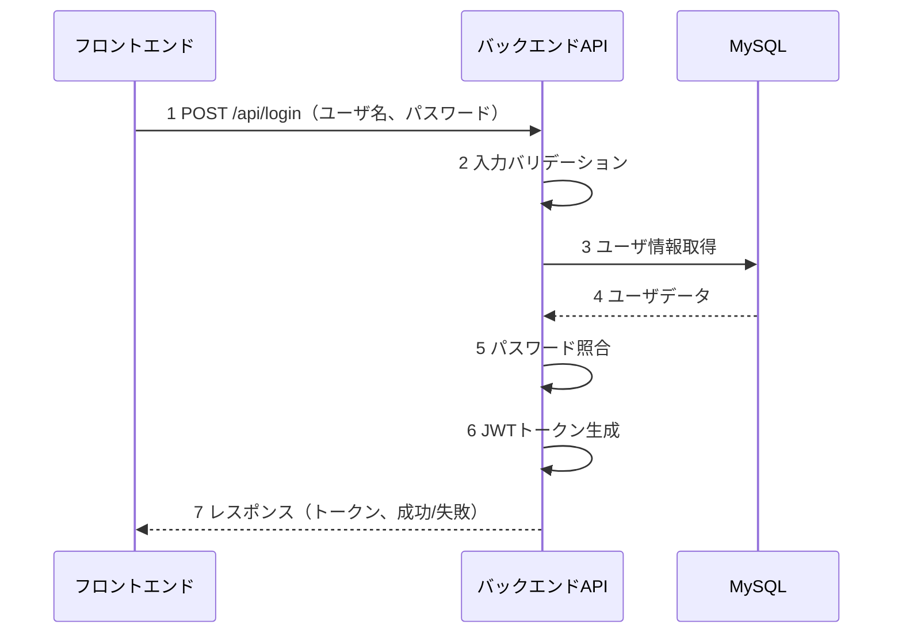
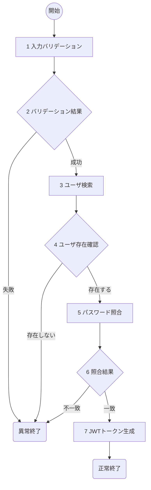

# ログイン(U02) 詳細設計書

## 1. 概要
- 機能名：ログイン(U02)
- 概要：ToDoアプリケーションのユーザログイン認証を行う。ユーザ名とパスワードを受け取り、データベースの認証情報と照合してJWTトークンを発行する。

## 2. シーケンス

1. フロントエンドからログイン情報（ユーザ名、パスワード）を受け取る
2. ユーザ名とパスワードの入力値をバリデーション
3. ユーザ名でusersテーブルからユーザ情報を取得
4. データベースからユーザデータを受け取る
5. 入力パスワードとハッシュ化されたパスワードを照合
6. 認証成功時はJWTトークンを生成
7. フロントエンドに認証結果とトークンを返却

## 3. フロー図

### 具体的な処理
1. **入力バリデーション**
    - ユーザ名(username)
        - 文字列であること
        - 1文字以上50文字以内であること
        - エラー時の処理
            - バリデーション失敗時はログメッセージ（E-U0007）を出力し、HTTPステータス400で処理を終了
    - パスワード(password)
        - 文字列であること
        - 1文字以上255文字以内であること
        - エラー時の処理
            - バリデーション失敗時はログメッセージ（E-U0008）を出力し、HTTPステータス400で処理を終了

2. **バリデーション結果**
    - 入力値のバリデーション結果を判定

3. **ユーザ検索**
    - 対象テーブル名：users
    - 取得条件：username = '入力されたユーザ名'
    - 取得フィールド：user_id, username, password_hash
    - エラー時の処理
        - DB接続が不可のときはログメッセージ（E-U0009）を出力し、HTTPステータス500で処理を終了

4. **ユーザ存在確認**
    - 指定されたユーザ名のユーザが存在するか確認
    - 存在しない場合はログメッセージ（E-U0010）を出力し、HTTPステータス401で処理を終了

5. **パスワード照合**
    - bcryptを使用して入力パスワードとDBのハッシュ化パスワードを照合
    - エラー時の処理
        - パスワード照合処理でエラーが発生した場合はログメッセージ（E-U0011）を出力し、HTTPステータス500で処理を終了

6. **照合結果**
    - パスワード照合結果を判定
    - 不一致の場合はログメッセージ（E-U0012）を出力し、HTTPステータス401で処理を終了

7. **JWTトークン生成**
    - ペイロード：user_id, username
    - 有効期限：1時間
    - 署名アルゴリズム：HS256
    - エラー時の処理
        - トークン生成失敗時はログメッセージ（E-U0013）を出力し、HTTPステータス500で処理を終了
    - 成功時の処理
        - ログメッセージ（I-U0002）を出力し、HTTPステータス200でJWTトークンを返却