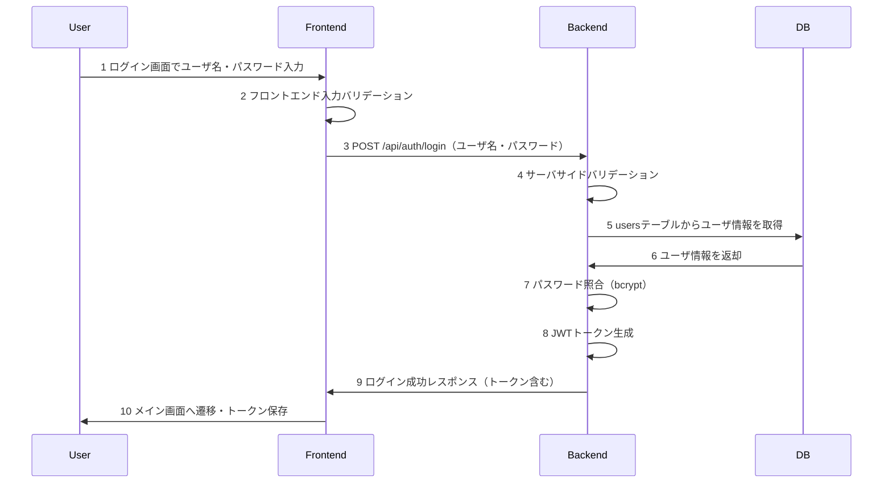
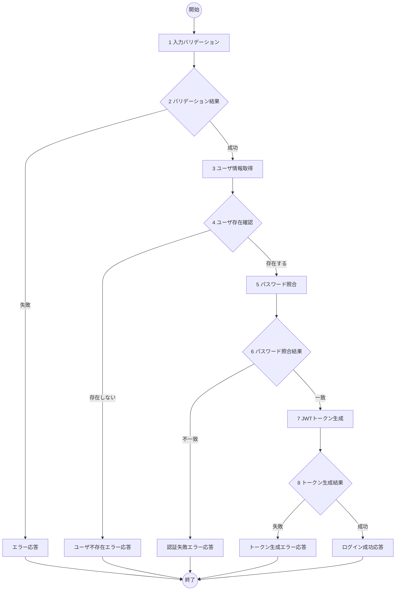

# ログイン機能 詳細設計書

## 1. 概要
- 機能名：ログイン(U02)
- 概要：ToDoアプリケーションのユーザ認証機能。ユーザ名・パスワードの入力を受け取り、bcryptでパスワード照合を行い、認証成功時にJWTトークンを発行してクライアントに返却する。

## 2. シーケンス

1. ユーザがログイン画面でユーザ名・パスワードを入力しログインボタンを押下
2. フロントエンドで入力値の基本バリデーションを実施
3. バックエンドAPIにログインリクエストを送信
4. バックエンドでサーバサイドバリデーションを実施
5. MySQLのusersテーブルからユーザ情報を取得
6. データベースからユーザ情報を受け取り
7. bcryptでパスワード照合を実施
8. 認証成功時にJWTトークンを生成
9. フロントエンドに成功レスポンス（JWTトークン含む）を返却
10. ユーザをメイン画面に遷移させ、トークンをlocalStorageに保存

## 3. フロー図

## 4. 具体的な処理例

### 1. 入力バリデーション
- username（ユーザ名）
  - 文字列であること
  - 50文字以内であること
  - 英数字のみであること
  - 空文字でないこと
  - エラー時の処理
    - バリデーション失敗時はログメッセージ（E-U0201）を出力し、処理を終了する
- password（パスワード）
  - 文字列であること
  - 8文字以上50文字以内であること
  - 空文字でないこと
  - エラー時の処理
    - バリデーション失敗時はログメッセージ（E-U0202）を出力し、処理を終了する

### 3. ユーザ情報取得
- 対象テーブル名：users
- 取得条件
  - username='入力されたユーザ名'
- 取得フィールド
  - id, username, password
- エラー時の処理
  - DB接続が不可のときはログメッセージ（E-U0203）を出力し、処理を終了
  - ユーザが存在しないときはログメッセージ（E-U0204）を出力し、処理を終了

### 5. パスワード照合
- bcryptライブラリを使用してパスワード照合
- 入力されたパスワードとDB内のハッシュ化パスワードを比較
- エラー時の処理
  - パスワード照合が失敗したときはログメッセージ（E-U0205）を出力し、処理を終了
  - bcrypt処理でエラーが発生したときはログメッセージ（E-U0206）を出力し、処理を終了

### 7. JWTトークン生成
- JWT（JSON Web Token）ライブラリを使用
- ペイロード
  - userId: ユーザID
  - username: ユーザ名
- トークン有効期限：24時間
- 署名キー：環境変数JWT_SECRETを使用
- エラー時の処理
  - トークン生成に失敗したときはログメッセージ（E-U0207）を出力し、処理を終了

## 5. チェック事項
- [x] シーケンス図には各処理に番号が振られているか
- [x] シーケンス図記述後、シーケンス図の各番号に対して簡単な処理内容が記述されているか
- [x] フロー図には各処理に番号が振られているか
- [x] フロー図後に各番号に対する具体的な処理が書かれているか。処理は実装するうえで過不足ない内容になっているか
- [x] エラーIDにかぶりはないか
- [x] claudeによる勝手な変更が無いか。提案等で勝手に変更していないこと。