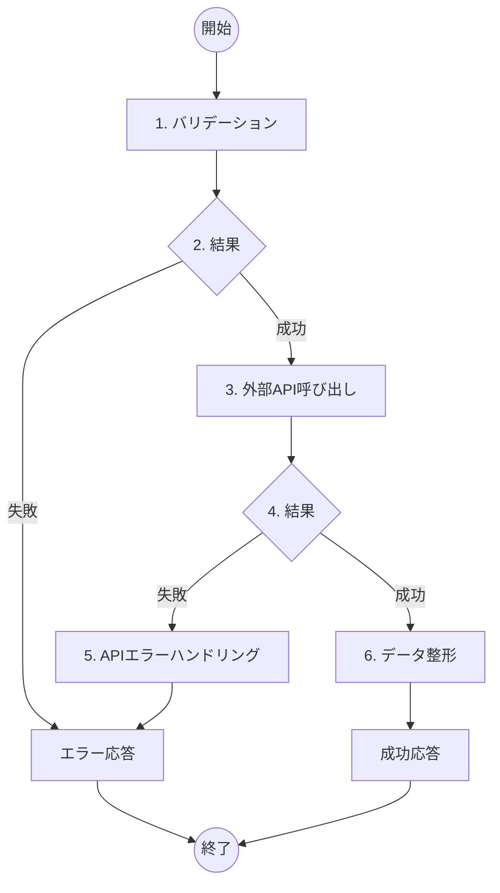

# 郵便番号検索機能 詳細設計書

## 概要
- **機能名**：郵便番号検索処理
- **概要**：入力された郵便番号を外部APIに送信し、取得した住所データを返す
- **入力**: 郵便番号（7桁数字）
- **出力**: 住所情報（JSON）
- **提供URL**: `api/address/search` (POST)

## フロー図



## 具体的な処理

### 1. バリデーション
- **postal_code（郵便番号）**
  - 文字列であること
  - 7桁の数字（ハイフンなし）の形式であること
  - 正規表現: `^[0-9]{7}$`

### 2. 結果
- バリデーション成功時：次の処理へ進む
- バリデーション失敗時：エラーID E010、400 Bad Requestを返す

### 3. 外部API呼び出し
- **接続先**: `https://zipcloud.ibsnet.co.jp/api/search`
- **メソッド**: GET
- **クエリパラメータ**:
  - zipcode: 入力された郵便番号
  - limit: 20（デフォルト値）
- **タイムアウト設定**: 5秒
- **リトライ回数**: 最大3回（指数バックオフ）
- **リトライ間隔**: 初回1秒、2回目2秒、3回目4秒

### 4. 結果
- HTTP 200受信時：次の処理へ進む
- HTTPエラー（4xx/5xx）受信時：エラーハンドリングへ進む
- タイムアウト発生時：エラーハンドリングへ進む

### 5. APIエラーハンドリング
- **APIステータスが400の場合**：
  - エラーID E011、400 Bad Request「郵便番号が見つかりませんでした」
- **APIステータスが500の場合**：
  - エラーID E012、503 Service Unavailable「外部サービスが一時的に利用できません」
- **タイムアウトの場合**：
  - エラーID E013、504 Gateway Timeout「外部サービスへの接続がタイムアウトしました」
- **その他のエラー**：
  - エラーID E014、502 Bad Gateway「外部サービスでエラーが発生しました」

### 6. データ整形
- 外部APIから取得したresultsフィールドをアプリケーション用の形式に整形
- 複数件取得時は最初の1件を採用
- フィールドマッピング:
  - prefecture: results[0].address1
  - city: results[0].address2
  - town: results[0].address3
  - full_address: address1 + address2 + address3 の結合

## エラーハンドリング

| エラーID | HTTPステータス | メッセージ | 発生条件 |
|---------|---------------|-----------|----------|
| E010 | 400 Bad Request | 郵便番号の形式が不正です | バリデーション失敗 |
| E011 | 400 Bad Request | 郵便番号が見つかりませんでした | APIエラー（400） |
| E012 | 503 Service Unavailable | 外部サービスが一時的に利用できません | APIエラー（500） |
| E013 | 504 Gateway Timeout | 外部サービスへの接続がタイムアウトしました | タイムアウト |
| E014 | 502 Bad Gateway | 外部サービスでエラーが発生しました | その他のAPI通信エラー |

## 成功時の応答例

```json
{
  "postal_code": "7830060",
  "prefecture": "高知県",
  "city": "南国市",
  "town": "蛍が丘",
  "full_address": "高知県南国市蛍が丘"
}
```

## 外部APIのレスポンス例（参考）

```json
{
  "message": null,
  "results": [
    {
      "address1": "高知県",
      "address2": "南国市",
      "address3": "蛍が丘",
      "kana1": "ｺｳﾁｹﾝ",
      "kana2": "ﾅﾝｺｸｼ",
      "kana3": "ﾎﾀﾙｶﾞｵｶ",
      "prefcode": "39",
      "zipcode": "7830060"
    }
  ],
  "status": 200
}
```