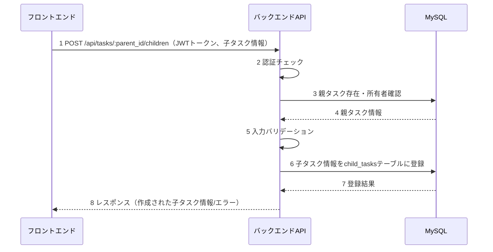
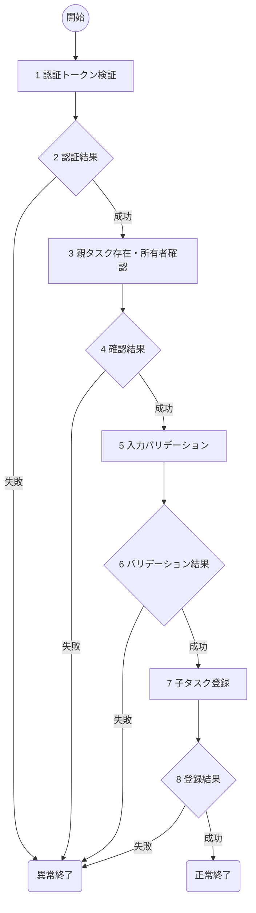

# 子タスク作成(S01) 詳細設計書

## 1. 概要
- 機能名：子タスク作成(S01)
- 概要：ToDoアプリケーションで指定された親タスクに紐づく子タスクの作成を行う。認証されたユーザが親タスクの所有者であることを確認後、子タスクの情報をchild_tasksテーブルに登録する。

## 2. シーケンス

1. フロントエンドから認証トークンと新規子タスク情報を受け取る
2. JWTトークンの認証チェックとユーザID取得
3. 指定された親タスクの存在確認と所有者確認
4. データベースから親タスク情報を受け取る
5. 子タスクのタイトルと詳細の入力値をバリデーション
6. 子タスク情報をデータベースに登録
7. データベースから登録結果を受け取る
8. フロントエンドに処理結果を返却

## 3. フロー図

### 具体的な処理
1. **認証トークン検証**
    - リクエストヘッダーからAuthorizationヘッダーを取得
    - Bearer形式のJWTトークンの存在確認と署名検証
    - トークンの有効期限チェック
    - ペイロードからuser_idを取得
    - エラー時の処理
        - トークンが存在しない場合はログメッセージ（E-S0001）を出力し、HTTPステータス401で処理を終了
        - トークンが無効な場合はログメッセージ（E-S0002）を出力し、HTTPステータス401で処理を終了

2. **認証結果**
    - JWTトークンの検証結果を判定

3. **親タスク存在・所有者確認**
    - 対象テーブル名：parent_tasks
    - 取得条件：parent_task_id = 'URLパラメータの親タスクID' AND user_id = '認証ユーザID'
    - 取得フィールド：parent_task_id, title, status
    - エラー時の処理
        - DB接続が不可の時はログメッセージ（E-S0003）を出力し、HTTPステータス500で処理を終了
        - 該当親タスクが存在しない、または所有者が異なる場合はログメッセージ（E-S0004）を出力し、HTTPステータス404で処理を終了

4. **確認結果**
    - 親タスクの存在と所有者の確認結果を判定

5. **入力バリデーション**
    - タイトル(title)
        - 文字列であること
        - 1文字以上255文字以内であること
        - エラー時の処理
            - バリデーション失敗時はログメッセージ（E-S0005）を出力し、HTTPステータス400で処理を終了
    - 詳細(description)
        - 文字列であること（空文字列も許可）
        - 65535文字以内であること（TEXT型の制限）
        - エラー時の処理
            - バリデーション失敗時はログメッセージ（E-S0006）を出力し、HTTPステータス400で処理を終了

6. **バリデーション結果**
    - 入力値のバリデーション結果を判定

7. **子タスク登録**
    - 対象テーブル名：child_tasks
    - 登録するフィールド
        - parent_task_id：URLパラメータの親タスクID
        - title：入力された子タスクタイトル
        - description：入力された子タスク詳細（空文字列の場合はNULL）
        - status：'pending'（デフォルト値）
        - created_at：現在日時（自動設定）
        - updated_at：現在日時（自動設定）
    - エラー時の処理
        - DB接続が不可の時はログメッセージ（E-S0007）を出力し、HTTPステータス500で処理を終了
        - DB登録が失敗した場合はログメッセージ（E-S0008）を出力し、HTTPステータス500で処理を終了

8. **登録結果**
    - データベース登録結果を判定
    - 成功時はログメッセージ（I-S0001）を出力し、HTTPステータス201で作成された子タスク情報（child_task_id, parent_task_id, title, description, status, created_at）を返却