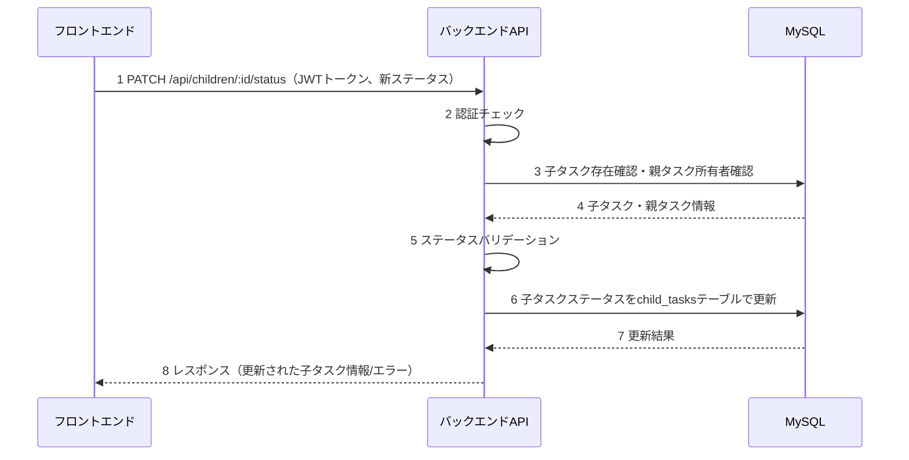
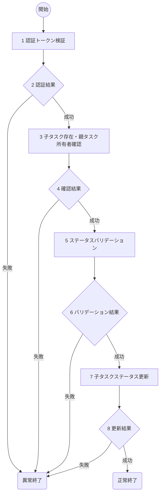

# 子タスク状態変更(S03) 詳細設計書

## 1. 概要
- 機能名：子タスク状態変更(S03)
- 概要：ToDoアプリケーションで既存の子タスクの完了状態を切り替える。認証されたユーザが親タスクの所有者であることを確認後、指定された子タスクのステータスをpendingとcompletedの間で切り替え、完了時はタイムスタンプを記録する。

## 2. シーケンス

1. フロントエンドから認証トークンと新しいステータス情報を受け取る
2. JWTトークンの認証チェックとユーザID取得
3. 指定された子タスクの存在確認と親タスクの所有者確認
4. データベースから子タスク・親タスク情報を受け取る
5. 新しいステータス値のバリデーション
6. 子タスクのステータスをデータベースで更新
7. データベースから更新結果を受け取る
8. フロントエンドに処理結果を返却

## 3. フロー図

### 具体的な処理
1. **認証トークン検証**
    - リクエストヘッダーからAuthorizationヘッダーを取得
    - Bearer形式のJWTトークンの存在確認と署名検証
    - トークンの有効期限チェック
    - ペイロードからuser_idを取得
    - エラー時の処理
        - トークンが存在しない場合はログメッセージ（E-S0017）を出力し、HTTPステータス401で処理を終了
        - トークンが無効な場合はログメッセージ（E-S0018）を出力し、HTTPステータス401で処理を終了

2. **認証結果**
    - JWTトークンの検証結果を判定

3. **子タスク存在・親タスク所有者確認**
    - 対象テーブル名：child_tasks JOIN parent_tasks
    - 取得条件：child_tasks.child_task_id = 'URLパラメータの子タスクID' AND parent_tasks.user_id = '認証ユーザID'
    - 取得フィールド：child_tasks.child_task_id, child_tasks.status, parent_tasks.parent_task_id
    - JOIN条件：child_tasks.parent_task_id = parent_tasks.parent_task_id
    - エラー時の処理
        - DB接続が不可の時はログメッセージ（E-S0019）を出力し、HTTPステータス500で処理を終了
        - 該当子タスクが存在しない、または親タスクの所有者が異なる場合はログメッセージ（E-S0020）を出力し、HTTPステータス404で処理を終了

4. **確認結果**
    - 子タスクの存在と親タスク所有者の確認結果を判定

5. **ステータスバリデーション**
    - ステータス(status)
        - 文字列であること
        - 'pending' または 'completed' のいずれかであること
        - エラー時の処理
            - バリデーション失敗時はログメッセージ（E-S0021）を出力し、HTTPステータス400で処理を終了

6. **バリデーション結果**
    - ステータス値のバリデーション結果を判定

7. **子タスクステータス更新**
    - 対象テーブル名：child_tasks
    - 更新条件：child_task_id = 'URLパラメータの子タスクID'
    - 更新するフィールド
        - status：入力された新しいステータス（'pending' または 'completed'）
        - updated_at：現在日時（自動設定）
    - エラー時の処理
        - DB接続が不可の時はログメッセージ（E-S0022）を出力し、HTTPステータス500で処理を終了
        - DB更新が失敗した場合はログメッセージ（E-S0023）を出力し、HTTPステータス500で処理を終了

8. **更新結果**
    - データベース更新結果を判定
    - 成功時はログメッセージ（I-S0003）を出力し、HTTPステータス200で更新された子タスク情報（child_task_id, parent_task_id, title, description, status, updated_at）を返却