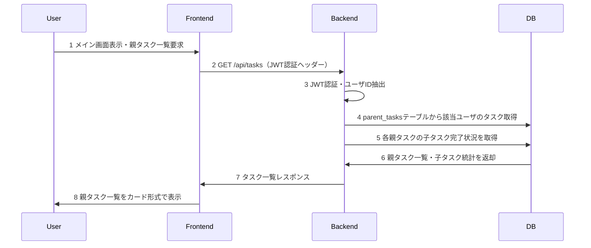
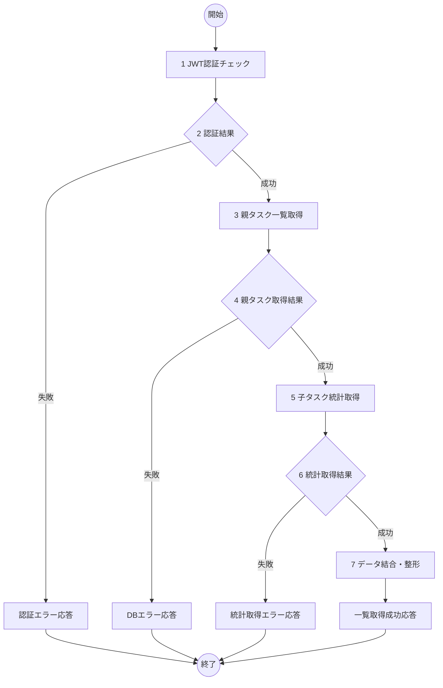

# 親タスク一覧表示機能 詳細設計書

## 1. 概要
- 機能名：親タスク一覧表示(T03)
- 概要：認証済みユーザに紐づく親タスクの一覧を表示する機能。parent_tasksテーブルから該当ユーザのデータを取得し、各タスクの子タスク完了状況も含めて表示する。

## 2. シーケンス


1. ユーザがメイン画面にアクセスし親タスク一覧の表示を要求
2. フロントエンドからバックエンドAPIに一覧取得リクエストを送信
3. JWTトークン認証を実施し、ユーザIDを抽出
4. MySQLのparent_tasksテーブルから該当ユーザのタスクを取得
5. 各親タスクに関連する子タスクの完了状況を集計
6. データベースから親タスク一覧と子タスク統計を受け取り
7. フロントエンドにタスク一覧レスポンスを返却
8. ユーザに親タスク一覧をMaterial-UIのCard形式で表示

## 3. フロー図


## 4. 具体的な処理例

### 1. JWT認証チェック
- リクエストヘッダーからAuthorizationトークンを取得
- JWTトークンの有効性を検証
- トークンからユーザIDを抽出
- エラー時の処理
  - トークンが無効またはなしの場合はログメッセージ（E-T0301）を出力し、処理を終了する

### 3. 親タスク一覧取得
- 対象テーブル名：parent_tasks
- 取得条件
  - user_id='認証済みユーザのID'
- 取得フィールド
  - id, title, description, created_at, updated_at
- ソート順：created_at DESC（作成日時の降順）
- エラー時の処理
  - DB接続が不可のときはログメッセージ（E-T0302）を出力し、処理を終了

### 5. 子タスク統計取得
- 対象テーブル名：child_tasks
- 各親タスクに対して以下を取得
  - 総子タスク数：COUNT(*)
  - 完了済み子タスク数：COUNT(*) WHERE is_completed = true
- JOINクエリでparent_tasksとchild_tasksを結合
- エラー時の処理
  - DB接続が不可のときはログメッセージ（E-T0303）を出力し、処理を終了
  - 統計取得に失敗したときはログメッセージ（E-T0304）を出力し、処理を終了

### 7. データ結合・整形
- 親タスク情報と子タスク統計を結合
- レスポンス形式に整形
  ```json
  {
    "tasks": [
      {
        "id": 1,
        "title": "プロジェクト準備",
        "description": "新規プロジェクトの準備作業",
        "created_at": "2024-01-01T00:00:00Z",
        "updated_at": "2024-01-01T00:00:00Z",
        "child_stats": {
          "total": 5,
          "completed": 3
        }
      }
    ]
  }
  ```
- エラー時の処理
  - データ整形に失敗したときはログメッセージ（E-T0305）を出力し、処理を終了

## 5. チェック事項
- [x] シーケンス図には各処理に番号が振られているか
- [x] シーケンス図記述後、シーケンス図の各番号に対して簡単な処理内容が記述されているか
- [x] フロー図には各処理に番号が振られているか
- [x] フロー図後に各番号に対する具体的な処理が書かれているか。処理は実装するうえで過不足ない内容になっているか
- [x] エラーIDにかぶりはないか
- [x] claudeによる勝手な変更が無いか。提案等で勝手に変更していないこと。