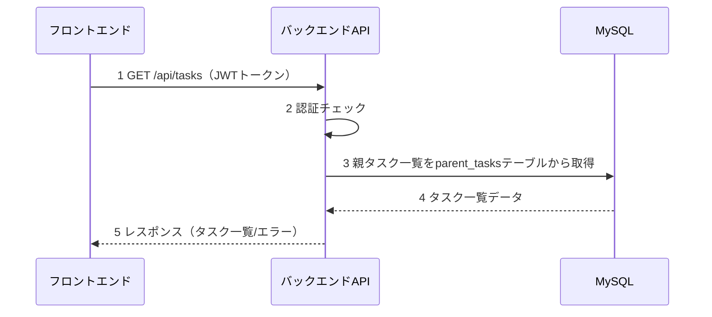
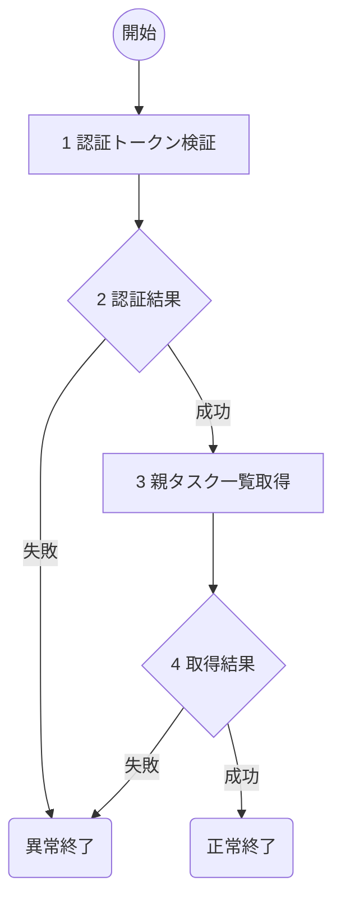

# 親タスク一覧表示(T03) 詳細設計書

## 1. 概要
- 機能名：親タスク一覧表示(T03)
- 概要：ToDoアプリケーションで認証されたユーザが所有する親タスクの一覧を表示する。parent_tasksテーブルから該当ユーザのタスク情報を取得し、一覧形式で返却する。

## 2. シーケンス

1. フロントエンドから認証トークンと共にタスク一覧取得要求を受け取る
2. JWTトークンの認証チェックとユーザID取得
3. 認証ユーザの親タスク一覧をデータベースから取得
4. データベースからタスク一覧データを受け取る
5. フロントエンドにタスク一覧を返却

## 3. フロー図

### 具体的な処理
1. **認証トークン検証**
    - リクエストヘッダーからAuthorizationヘッダーを取得
    - Bearer形式のJWTトークンの存在確認と署名検証
    - トークンの有効期限チェック
    - ペイロードからuser_idを取得
    - エラー時の処理
        - トークンが存在しない場合はログメッセージ（E-T0015）を出力し、HTTPステータス401で処理を終了
        - トークンが無効な場合はログメッセージ（E-T0016）を出力し、HTTPステータス401で処理を終了

2. **認証結果**
    - JWTトークンの検証結果を判定

3. **親タスク一覧取得**
    - 対象テーブル名：parent_tasks
    - 取得条件：user_id = '認証ユーザID'
    - 取得フィールド：parent_task_id, title, description, status, created_at, updated_at
    - ソート順：created_at DESC（作成日時の降順）
    - エラー時の処理
        - DB接続が不可の時はログメッセージ（E-T0017）を出力し、HTTPステータス500で処理を終了
        - DB取得処理でエラーが発生した場合はログメッセージ（E-T0018）を出力し、HTTPステータス500で処理を終了

4. **取得結果**
    - データベースからの取得結果を判定
    - 成功時はログメッセージ（I-T0003）を出力し、HTTPステータス200でタスク一覧（配列形式）を返却
    - タスクが0件の場合も正常として空配列を返却