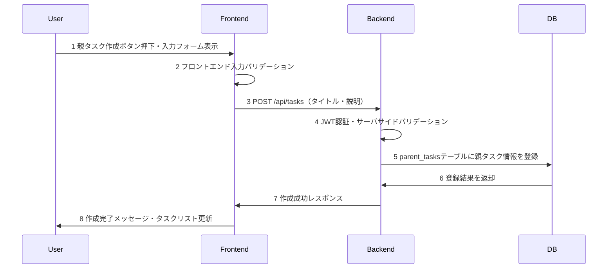
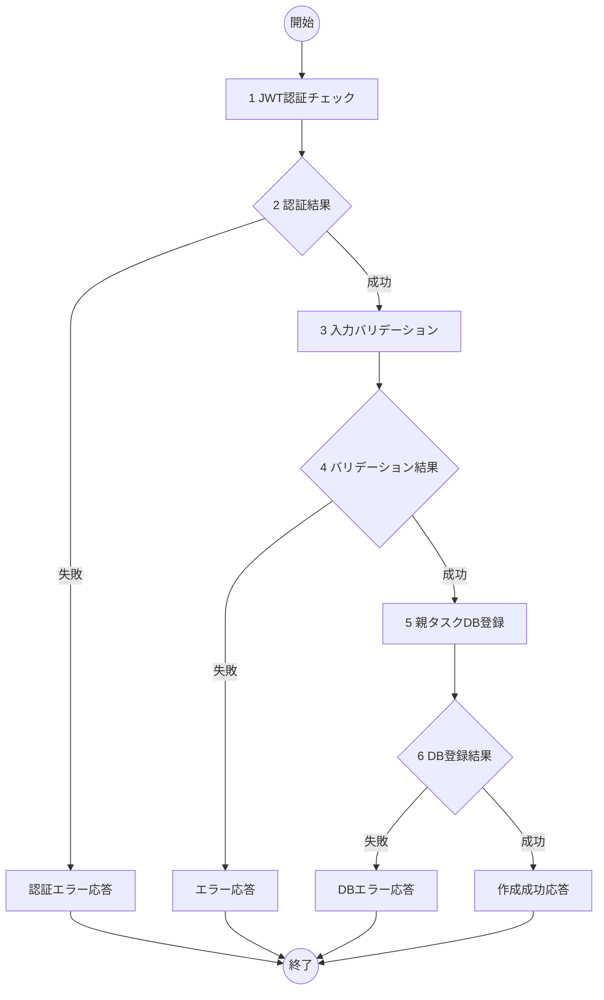

# 親タスク作成機能 詳細設計書

## 1. 概要
- 機能名：親タスク作成(T01)
- 概要：ユーザに紐づく親タスクの新規作成機能。認証済みユーザがタスク名・説明を入力して、parent_tasksテーブルに新規レコードを作成する。

## 2. シーケンス

1. ユーザが親タスク作成ボタンを押下してモーダルダイアログを表示
2. フロントエンドで入力値の基本バリデーションを実施
3. バックエンドAPIに親タスク作成リクエストを送信
4. JWTトークン認証とサーバサイドバリデーションを実施
5. MySQLのparent_tasksテーブルに親タスク情報を登録
6. データベースから登録結果を受け取り
7. フロントエンドに成功レスポンスを返却
8. ユーザに作成完了を通知し、タスクリストを更新

## 3. フロー図

## 4. 具体的な処理例

### 1. JWT認証チェック
- リクエストヘッダーからAuthorizationトークンを取得
- JWTトークンの有効性を検証
- トークンからユーザIDを抽出
- エラー時の処理
  - トークンが無効またはなしの場合はログメッセージ（E-T0101）を出力し、処理を終了する

### 3. 入力バリデーション
- title（タスクタイトル）
  - 文字列であること
  - 255文字以内であること
  - 空文字でないこと
  - エラー時の処理
    - バリデーション失敗時はログメッセージ（E-T0102）を出力し、処理を終了する
- description（タスク説明）
  - 文字列であること（任意項目）
  - 1000文字以内であること
  - エラー時の処理
    - バリデーション失敗時はログメッセージ（E-T0103）を出力し、処理を終了する

### 5. 親タスクDB登録
- 対象テーブル名：parent_tasks
- 登録するフィールド
  - user_idには認証済みユーザのID
  - titleには入力されたタスクタイトル
  - descriptionには入力されたタスク説明（任意）
  - created_atは自動設定（CURRENT_TIMESTAMP）
  - updated_atは自動設定（CURRENT_TIMESTAMP）
- エラー時の処理
  - DB接続が不可のときはログメッセージ（E-T0104）を出力し、処理を終了
  - その他DB登録が不可であるときはログメッセージ（E-T0105）を出力し、処理を終了

## 5. チェック事項
- [x] シーケンス図には各処理に番号が振られているか
- [x] シーケンス図記述後、シーケンス図の各番号に対して簡単な処理内容が記述されているか
- [x] フロー図には各処理に番号が振られているか
- [x] フロー図後に各番号に対する具体的な処理が書かれているか。処理は実装するうえで過不足ない内容になっているか
- [x] エラーIDにかぶりはないか
- [x] claudeによる勝手な変更が無いか。提案等で勝手に変更していないこと。