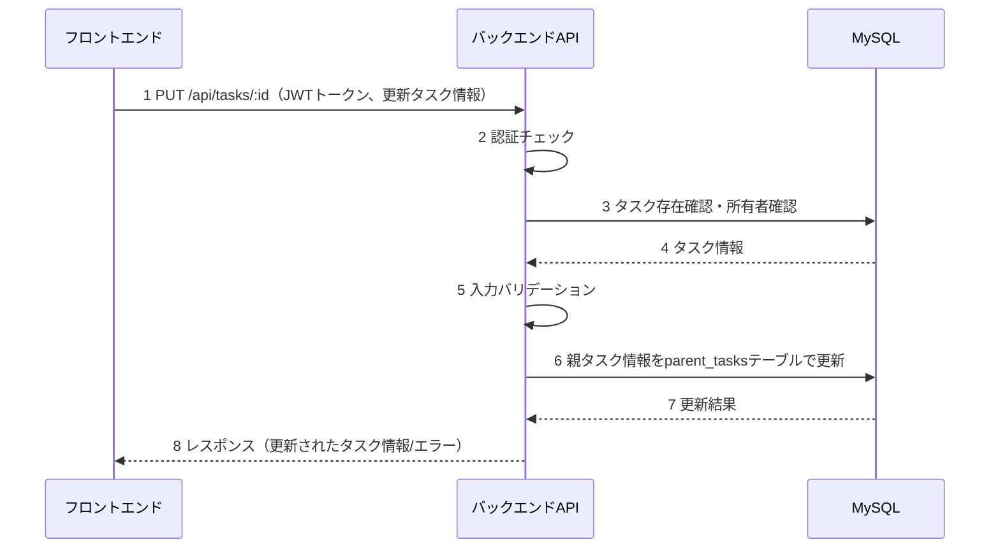
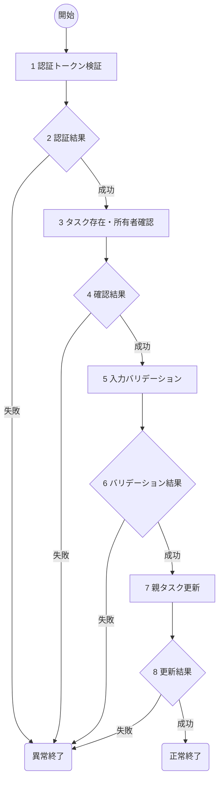

# 親タスク編集(T02) 詳細設計書

## 1. 概要
- 機能名：親タスク編集(T02)
- 概要：ToDoアプリケーションの既存親タスクの編集を行う。認証されたユーザが自身のタスクのタイトルと詳細を更新し、parent_tasksテーブルの該当レコードを更新する。

## 2. シーケンス

1. フロントエンドから認証トークンと更新する親タスク情報を受け取る
2. JWTトークンの認証チェックとユーザID取得
3. 指定されたタスクの存在確認と所有者確認
4. データベースからタスク情報を受け取る
5. 更新するタスクタイトルと詳細の入力値をバリデーション
6. 親タスク情報をデータベースで更新
7. データベースから更新結果を受け取る
8. フロントエンドに処理結果を返却

## 3. フロー図

### 具体的な処理
1. **認証トークン検証**
    - リクエストヘッダーからAuthorizationヘッダーを取得
    - Bearer形式のJWTトークンの存在確認と署名検証
    - トークンの有効期限チェック
    - ペイロードからuser_idを取得
    - エラー時の処理
        - トークンが存在しない場合はログメッセージ（E-T0007）を出力し、HTTPステータス401で処理を終了
        - トークンが無効な場合はログメッセージ（E-T0008）を出力し、HTTPステータス401で処理を終了

2. **認証結果**
    - JWTトークンの検証結果を判定

3. **タスク存在・所有者確認**
    - 対象テーブル名：parent_tasks
    - 取得条件：parent_task_id = 'URLパラメータのタスクID' AND user_id = '認証ユーザID'
    - 取得フィールド：parent_task_id, title, description, status
    - エラー時の処理
        - DB接続が不可の時はログメッセージ（E-T0009）を出力し、HTTPステータス500で処理を終了
        - 該当タスクが存在しない、または所有者が異なる場合はログメッセージ（E-T0010）を出力し、HTTPステータス404で処理を終了

4. **確認結果**
    - タスクの存在と所有者の確認結果を判定

5. **入力バリデーション**
    - タイトル(title)
        - 文字列であること
        - 1文字以上255文字以内であること
        - エラー時の処理
            - バリデーション失敗時はログメッセージ（E-T0011）を出力し、HTTPステータス400で処理を終了
    - 詳細(description)
        - 文字列であること（空文字列も許可）
        - 65535文字以内であること（TEXT型の制限）
        - エラー時の処理
            - バリデーション失敗時はログメッセージ（E-T0012）を出力し、HTTPステータス400で処理を終了

6. **バリデーション結果**
    - 入力値のバリデーション結果を判定

7. **親タスク更新**
    - 対象テーブル名：parent_tasks
    - 更新条件：parent_task_id = 'URLパラメータのタスクID' AND user_id = '認証ユーザID'
    - 更新するフィールド
        - title：入力されたタスクタイトル
        - description：入力されたタスク詳細（空文字列の場合はNULL）
        - updated_at：現在日時（自動設定）
    - エラー時の処理
        - DB接続が不可の時はログメッセージ（E-T0013）を出力し、HTTPステータス500で処理を終了
        - DB更新が失敗した場合はログメッセージ（E-T0014）を出力し、HTTPステータス500で処理を終了

8. **更新結果**
    - データベース更新結果を判定
    - 成功時はログメッセージ（I-T0002）を出力し、HTTPステータス200で更新されたタスク情報（parent_task_id, title, description, status, updated_at）を返却