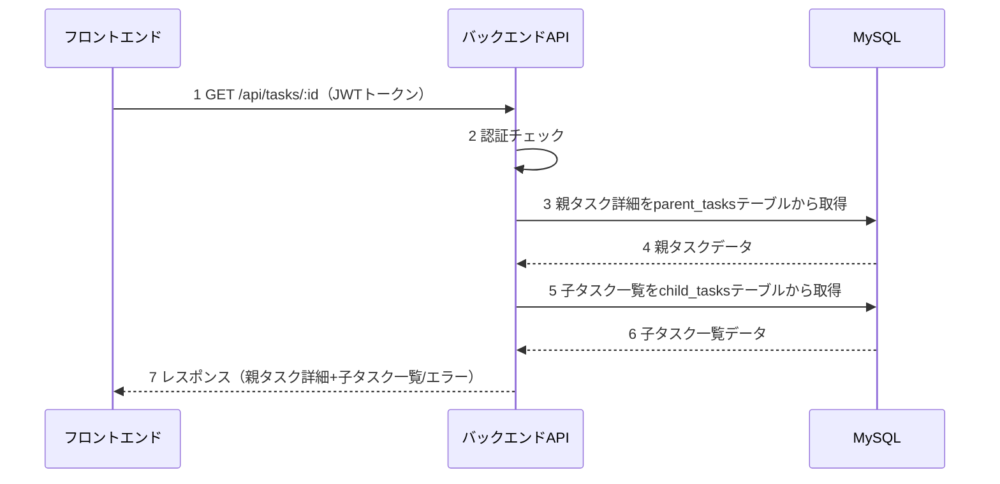
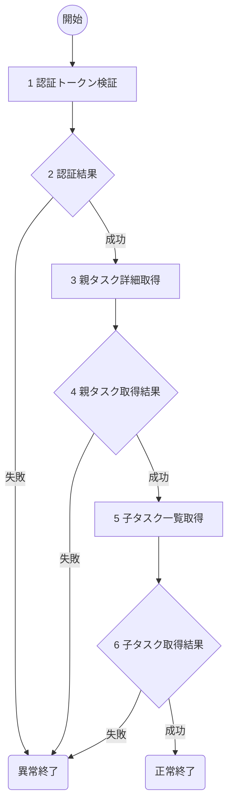

# 親タスク詳細表示(T04) 詳細設計書

## 1. 概要
- 機能名：親タスク詳細表示(T04)
- 概要：ToDoアプリケーションで指定された親タスクの詳細情報と関連する子タスク一覧を表示する。parent_tasksテーブルとchild_tasksテーブルから情報を取得し、詳細画面用のデータを返却する。

## 2. シーケンス

1. フロントエンドから認証トークンと共に特定親タスクの詳細取得要求を受け取る
2. JWTトークンの認証チェックとユーザID取得
3. 指定された親タスクの詳細情報をデータベースから取得
4. データベースから親タスクデータを受け取る
5. 該当親タスクに紐づく子タスク一覧をデータベースから取得
6. データベースから子タスク一覧データを受け取る
7. フロントエンドに親タスク詳細と子タスク一覧を返却

## 3. フロー図

### 具体的な処理
1. **認証トークン検証**
    - リクエストヘッダーからAuthorizationヘッダーを取得
    - Bearer形式のJWTトークンの存在確認と署名検証
    - トークンの有効期限チェック
    - ペイロードからuser_idを取得
    - エラー時の処理
        - トークンが存在しない場合はログメッセージ（E-T0019）を出力し、HTTPステータス401で処理を終了
        - トークンが無効な場合はログメッセージ（E-T0020）を出力し、HTTPステータス401で処理を終了

2. **認証結果**
    - JWTトークンの検証結果を判定

3. **親タスク詳細取得**
    - 対象テーブル名：parent_tasks
    - 取得条件：parent_task_id = 'URLパラメータのタスクID' AND user_id = '認証ユーザID'
    - 取得フィールド：parent_task_id, title, description, status, created_at, updated_at
    - エラー時の処理
        - DB接続が不可の時はログメッセージ（E-T0021）を出力し、HTTPステータス500で処理を終了
        - 該当タスクが存在しない、または所有者が異なる場合はログメッセージ（E-T0022）を出力し、HTTPステータス404で処理を終了

4. **親タスク取得結果**
    - 親タスクの取得結果を判定

5. **子タスク一覧取得**
    - 対象テーブル名：child_tasks
    - 取得条件：parent_task_id = 'URLパラメータのタスクID'
    - 取得フィールド：child_task_id, title, description, status, created_at, updated_at
    - ソート順：created_at ASC（作成日時の昇順）
    - エラー時の処理
        - DB接続が不可の時はログメッセージ（E-T0023）を出力し、HTTPステータス500で処理を終了
        - DB取得処理でエラーが発生した場合はログメッセージ（E-T0024）を出力し、HTTPステータス500で処理を終了

6. **子タスク取得結果**
    - 子タスク一覧の取得結果を判定
    - 成功時はログメッセージ（I-T0004）を出力し、HTTPステータス200で親タスク詳細と子タスク一覧（配列形式）を返却
    - 子タスクが0件の場合も正常として空配列を返却